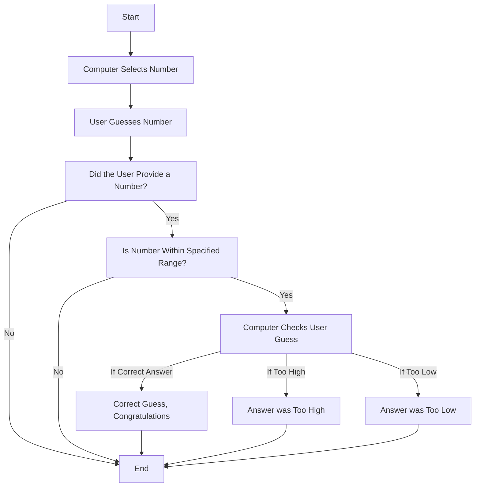

This flowchart is a summarized version of a computer picking a random number in a specified range and having the user guess the number.

Line #3 | It starts with node A[Start], which tells the computer to start running the program. Node A is directed toward Node B.
Line #3 | Node B[Computer Selects Number] is where the computer will select a number in its specified range.
Line #4 | Node B is directed toward Node C. Node C[User Guesses Number] is when the computer allows input from the user and requires the user to input what should be a guessed number.
Line #5 | Node C is directed toward Node D. Node D[Did the User Provide a Number?] has the computer check if what the user inputted falls into a number characteristic.
Line #6 | Node D is directed toward Node E if the answer is "Yes". Node E[Is Number Within Specified Range?] has the computer check if the user has input a number that falls into the specified range that the computer was limited to guessing.
Line #7 | Node D is directed toward Node Z if the answer is "No". Node Z[End] is the end of the program and will stop it from continuing.
Line #8 | Node E is directed toward Node F if the answer is "Yes". Node F[Computer Checks User Guess] has the computer check if the number the user has input matches the number the computer generated.
Line #9 | Node E is directed toward Node Z if the answer is "No". Node Z[End] is the end of the program and will stop it from continuing.
Line #10 | Node F is directed toward Node G if the answer is "If Correct Answer". Node G[Correct Guess, Congratulations] then compliments the user on inputting the number that matches what the computer generated.
Line #11 | Node G is directed toward Node Z as the program has finished.
Line #12 | Node F is directed toward Node H if the answer is "If Too High". Node H[Answer was Too High] tells the user that their guess was above what the computer generated.
Line #13 | Node H is directed toward Node Z as the program has finished.
Line #14 | Node F is directed toward Node I if the answer is "If Too Low". Node I[Answer was Too Low] tells the user that their guess was below what the computer generated.
Line #15 | Node I is directed toward Node Z as the program has now completely finished and there are no more possibilities to run.
