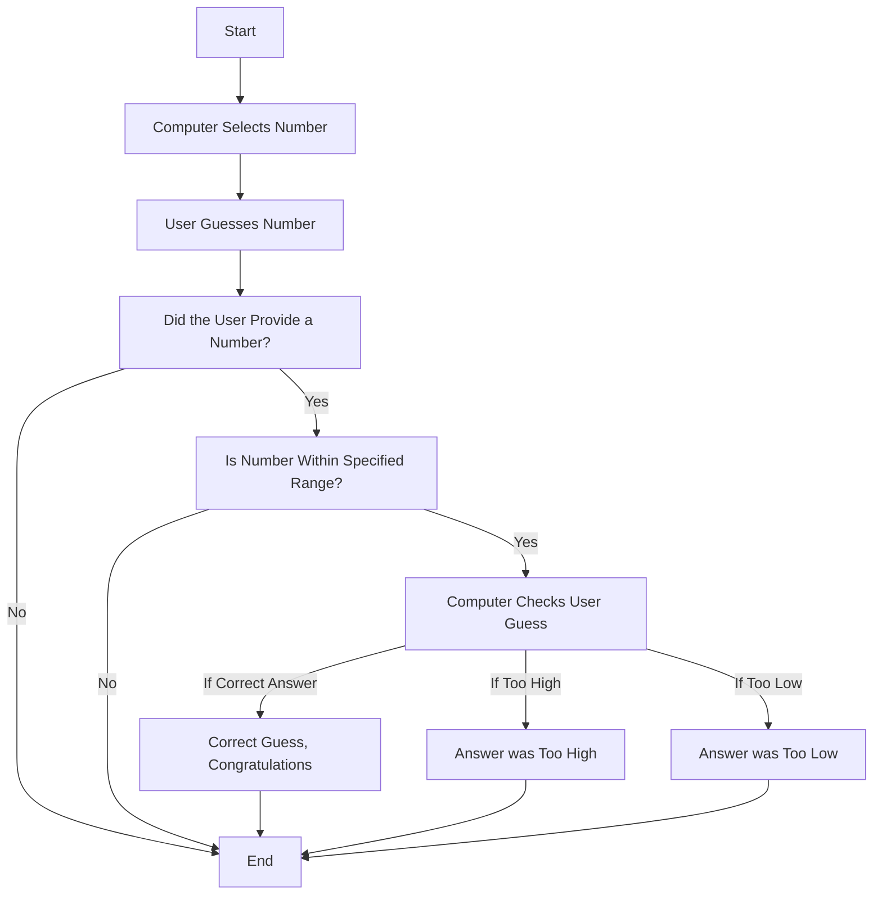

```mermaid
flowchart TD
 A[Start] --> B[Computer Selects Number]
    B --> C[User Guesses Number]
    C -->D[Did the User Provide a Number?]
    D --> |Yes| E[Is Number Within Specified Range?]
    D --> |No| Z[End]
    E --> |Yes| F[Computer Checks User Guess]
    E --> |No| Z[End]
    F --> |If Correct Answer| G[Correct Guess, Congratulations]
    G --> Z[End]
    F --> |If Too High| H[Answer was Too High]
    H --> Z[End]
    F --> |If Too Low| I[Answer was Too Low]
    I --> Z[End]

```
